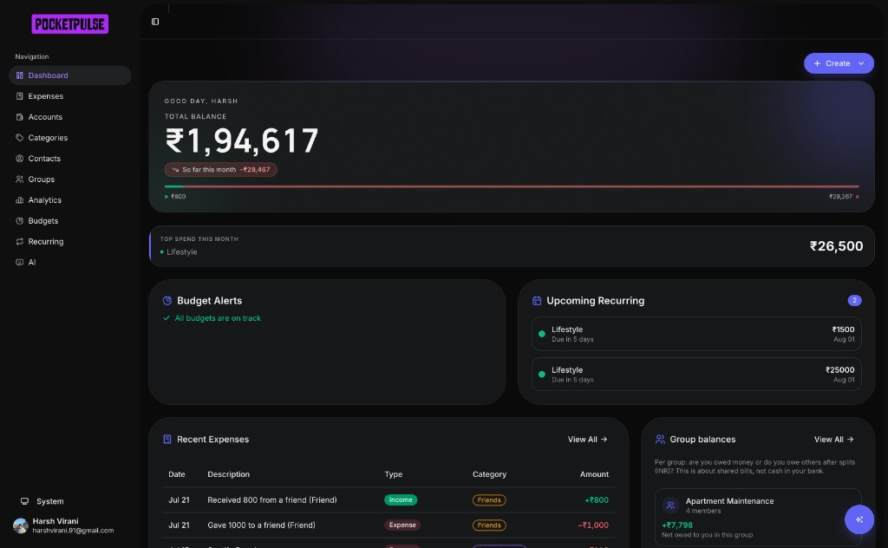

<div align="center">


# PocketPulse

**AI-powered personal finance, in your pocket. 💜**

Track expenses, split bills, manage budgets, and chat with an AI assistant that understands your money — all in a fast, installable Progressive Web App.

[](https://nextjs.org)
[](https://react.dev)
[](https://www.typescriptlang.org)
[](https://tailwindcss.com)

[](https://www.prisma.io)
[](https://www.postgresql.org)
[](https://clerk.com)
[](https://ai.google.dev)
[](#-license)

[Features](#-features) · [Tech Stack](#%EF%B8%8F-tech-stack) · [Getting Started](#-getting-started) · [Environment Variables](#-environment-variables) · [Scripts](#-available-scripts) · [Project Structure](#%EF%B8%8F-project-structure)

<br />



</div>

---

## 🎯 Overview

PocketPulse is a full-stack expense tracker built for how people actually spend today: UPI notifications, bank SMS, shared apartment bills, and subscriptions that renew when you least expect them. Instead of manual data entry, you can paste a wall of bank messages or drop in screenshots — Gemini reads them, extracts every transaction, flags duplicates, and files them under the right category.

It ships as a Progressive Web App: installable on iOS, Android, and desktop, with offline support and a mobile-first UI that works from a 375px phone up to a widescreen dashboard.

## ✨ Features

### 💸 Expense Tracking

- Record income and expenses with amount, category, date, account, payment method (UPI, card, bank transfer, cash), and notes
- Color-coded categories — seeded defaults plus unlimited user-defined ones
- Multiple accounts (savings, current, wallet, credit card, cash) with live balances
- Filterable, searchable expense list: data table on desktop, date-grouped cards on mobile

### 🤖 Smart Bulk Import (AI)

- **Paste text** — drop in one or many bank SMS / payment notifications; Gemini extracts every transaction (amount, merchant, date, category, payment method) and ignores OTPs and promotional messages
- **Screenshots** — upload, drag-drop, clipboard-paste, or camera-capture up to 4 screenshots of SMS threads or banking apps; a vision model reads them directly, no OCR step
- **CSV / Excel** — classic import with a downloadable template pre-filled with your categories and accounts
- Every AI import lands in an editable review table with per-row confidence scores and automatic duplicate detection before anything is saved
- Export filtered expenses to CSV or Excel

### 👥 Groups and Bill Splitting

- Shared expense groups with equal, percentage, or custom splits
- Settlements, outstanding-debt tracking, and per-group balance summaries
- Contacts directory for the people you split with

### 📊 Budgets, Recurring, and Analytics

- Per-category budgets with progress rings and approaching-limit / over-budget alerts
- Recurring expenses (daily to yearly) with upcoming-payment preview and one-tap processing
- Spending trends, category breakdown, and month-over-month comparison against the prior period

### 💬 AI Assistant

- Conversational assistant (Google Gemini via the Vercel AI SDK) that can query and create expenses with tool calls
- Natural-language expense entry — "450 on Swiggy yesterday, UPI"
- AI-generated spending insights on the dashboard
- Per-user rate limiting and automatic model fallback under load

### 🎨 Design and Accessibility

- Revolut-inspired design system: cobalt accent, ink-and-cloud neutrals, pill-shaped controls, liquid-glass bottom navigation
- Typography tuned for money — Inter for UI, Manrope tabular numerals for balances, JetBrains Mono for code-like text
- Full light and dark modes driven by CSS design tokens
- Accessibility-first: labeled icon controls, keyboard-operable cards and navigation, WCAG-conscious contrast, `prefers-reduced-motion` support, 36px+ touch targets

### 📱 Progressive Web App

- Installable on mobile and desktop with home-screen shortcuts
- Offline support with a dedicated offline page (Serwist service worker)
- Safe-area-aware floating controls and responsive layouts throughout
- Optional web push notifications (VAPID)

## 🛠️ Tech Stack

| Layer          | Technology                                                                                                                 |
| -------------- | -------------------------------------------------------------------------------------------------------------------------- |
| Framework      | [Next.js 16](https://nextjs.org) (App Router) + [React 19](https://react.dev)                                              |
| Language       | [TypeScript](https://www.typescriptlang.org)                                                                               |
| Styling        | [Tailwind CSS 4](https://tailwindcss.com) + [shadcn/ui](https://ui.shadcn.com) (Radix primitives)                          |
| Database       | [PostgreSQL](https://www.postgresql.org) + [Prisma ORM](https://www.prisma.io)                                             |
| Authentication | [Clerk](https://clerk.com) with webhook-based user sync                                                                    |
| AI             | [Vercel AI SDK](https://sdk.vercel.ai) + [Google Gemini](https://ai.google.dev) (structured outputs, vision, tool calling) |
| Data Fetching  | [TanStack Query](https://tanstack.com/query)                                                                               |
| Forms          | [React Hook Form](https://react-hook-form.com) + [Zod](https://zod.dev)                                                    |
| Charts         | [Recharts](https://recharts.org)                                                                                           |
| PWA            | [Serwist](https://serwist.pages.dev) service worker + Web App Manifest                                                     |
| Theming        | [next-themes](https://github.com/pacocoursey/next-themes) with oklch design tokens                                         |
| Icons          | [Tabler Icons](https://tabler.io/icons)                                                                                    |

## 🚀 Getting Started

### Prerequisites

- Node.js 20+
- pnpm
- PostgreSQL database
- A [Clerk](https://clerk.com) account (authentication)
- A [Google AI Studio](https://aistudio.google.com) API key (AI features)

### Installation

1. **Clone the repository**

   ```bash
   git clone https://github.com/HarshVirani914/expense-tracker-app.git
   cd expense-tracker-app
   ```

2. **Install dependencies**

   ```bash
   pnpm install
   ```

3. **Configure environment variables**

   ```bash
   cp .env.example .env
   ```

   Fill in the values — see [Environment Variables](#-environment-variables) below.

4. **Set up the database**

   ```bash
   pnpm db:generate
   pnpm db:migrate
   pnpm db:seed   # optional: sample data
   ```

5. **Start the dev server**

   ```bash
   pnpm dev
   ```

   Open [http://localhost:3000](http://localhost:3000).

### Production Build

```bash
pnpm build
pnpm start
```

> [!NOTE]
> PWA features (service worker, offline support) only work in production mode.

## 🔐 Environment Variables

All variables are documented in [`.env.example`](.env.example).

| Variable                            | Required | Description                                                            |
| ----------------------------------- | -------- | ---------------------------------------------------------------------- |
| `DATABASE_URL`                      | Yes      | PostgreSQL connection string                                           |
| `NEXT_PUBLIC_CLERK_PUBLISHABLE_KEY` | Yes      | Clerk publishable key (Clerk Dashboard)                                |
| `CLERK_SECRET_KEY`                  | Yes      | Clerk secret key (Clerk Dashboard)                                     |
| `GOOGLE_GENERATIVE_AI_API_KEY`      | Yes      | Google Gemini key — powers smart import, AI chat, and insights         |
| `NEXT_PUBLIC_APP_URL`               | No       | Public app URL for the PWA manifest (default: `http://localhost:3000`) |
| `CLERK_WEBHOOK_SECRET`              | No       | Secret for Clerk user-sync webhooks                                    |
| `LOG_LEVEL`                         | No       | `debug` \| `info` \| `warn` \| `error`                                 |
| `NEXT_PUBLIC_VAPID_PUBLIC_KEY`      | No       | VAPID public key for web push notifications                            |
| `VAPID_PRIVATE_KEY`                 | No       | VAPID private key for web push notifications                           |

## 📜 Available Scripts

| Script             | Description                              |
| ------------------ | ---------------------------------------- |
| `pnpm dev`         | Start the development server (Turbopack) |
| `pnpm build`       | Build for production                     |
| `pnpm start`       | Start the production server              |
| `pnpm lint`        | Run ESLint                               |
| `pnpm db:generate` | Generate the Prisma client               |
| `pnpm db:migrate`  | Run database migrations                  |
| `pnpm db:seed`     | Seed the database with sample data       |
| `pnpm db:studio`   | Open Prisma Studio                       |
| `pnpm db:push`     | Push schema changes to the database      |
| `pnpm db:reset`    | Reset the database (dev only)            |

## 🗂️ Project Structure

```
├── prisma/                 # Database schema, migrations, and seed data
├── public/                 # Static assets, PWA icons, service worker
├── docs/
│   └── screenshots/        # README screenshots
└── src/
    ├── app/                # Next.js App Router
    │   ├── (protected)/    # Auth-required routes (dashboard, expenses, ...)
    │   ├── manifest.ts     # PWA manifest
    │   └── layout.tsx      # Root layout with providers
    ├── components/         # Reusable UI components
    ├── features/           # Feature-specific components and logic
    ├── hooks/              # Custom React hooks
    ├── lib/                # Utilities and helpers
    ├── providers/          # Context providers
    └── server/             # Server-side code (queries, actions, AI)
```

## 📲 Installing as a PWA

| Platform              | How to install                                                         |
| --------------------- | ---------------------------------------------------------------------- |
| Desktop (Chrome/Edge) | Run a production build, then click the install icon in the address bar |
| Android (Chrome)      | Menu → "Add to Home Screen"                                            |
| iOS (Safari)          | Share → "Add to Home Screen"                                           |

To test offline mode: Chrome DevTools → Application → Service Workers → check "Offline", then navigate the cached pages.

## 🤝 Contributing

Contributions are welcome. To get started:

1. Fork the repository
2. Create a feature branch (`git checkout -b feature/amazing-feature`)
3. Commit your changes (`git commit -m "Add amazing feature"`)
4. Push to the branch (`git push origin feature/amazing-feature`)
5. Open a Pull Request

## 📄 License

Distributed under the MIT License. See [`LICENSE`](LICENSE) for more information.

---

<div align="center">

Built with 💜 by [Harsh Virani](https://github.com/HarshVirani914)

</div>
